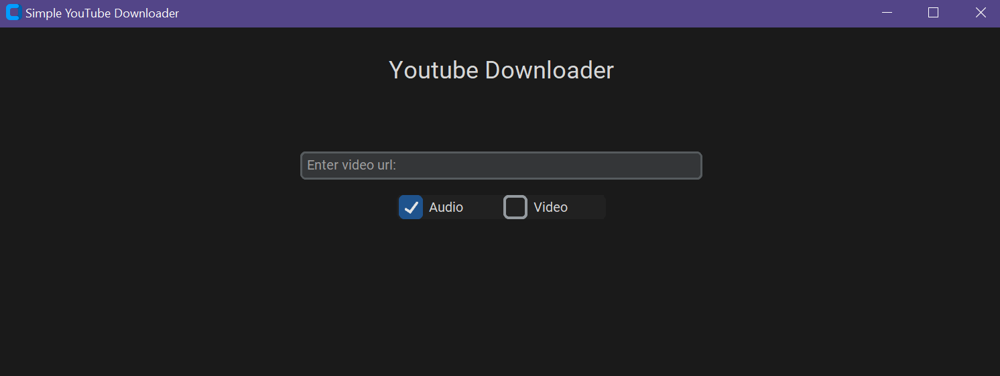

<!--
*** Thanks for checking out the Best-README-Template. If you have a suggestion
*** that would make this better, please fork the repo and create a pull request
*** or simply open an issue with the tag "enhancement".
*** Don't forget to give the project a star!
*** Thanks again! Now go create something AMAZING! :D
-->

<!-- PROJECT SHIELDS -->
<!--
*** I'm using markdown "reference style" links for readability.
*** Reference links are enclosed in brackets [ ] instead of parentheses ( ).
*** See the bottom of this document for the declaration of the reference variables
*** for contributors-url, forks-url, etc. This is an optional, concise syntax you may use.
*** https://www.markdownguide.org/basic-syntax/#reference-style-links
-->
[![Contributors][contributors-shield]][contributors-url]
[![Forks][forks-shield]][forks-url]
[![MIT License][license-shield]][license-url]
[![LinkedIn][linkedin-shield]][linkedin-url]

<!-- PROJECT LOGO -->
 

  

<h3 align="center">Desktop Youtube Download Client</h3>

  

    A simple application that allows the user to enter a YouTube video link, choose the file type and quality, and download the video. Built using the tkinter and pytube libraries.
     
  

<!-- TABLE OF CONTENTS -->

  
Table of Contents

  <ol>
    <li>
      <a href="#about-the-project">About The Project</a>
      <ul>
        <li><a href="#built-with">Built With</a></li>
      </ul>
    </li>
    <li>
      <a href="#getting-started">Getting Started</a>
      <ul>
        <li><a href="#prerequisites">Prerequisites</a></li>
        <li><a href="#installation">Installation</a></li>
      </ul>
    </li>
    <li><a href="#contributing">Contributing</a></li>
    <li><a href="#license">License</a></li>
    <li><a href="#contact">Contact</a></li>
  </ol>

<!-- ABOUT THE PROJECT -->

## About The Project

A minimalistic desktop application built with Python utilizing the Pytube library. It allows
users to download both audio and video files from YouTube. The app offers a fast and reliable way to download YouTube
videos, with the added ability to choose between downloading video or audio only format.

The user interface is simple, with a command line prompts for the user to enter the YouTube video link, and select the
desired format (audio or video), after which the download process begins. The app also has a built-in progress bar to
keep track of the download progress.

This project is a great example of how the Pytube library can be used to develop a functional YouTube downloader. It
demonstrates the use of Python for building command-line interface applications, and the ability to work with external
libraries.

(<a href="#top">back to top</a>)

### Built With

This section should list any major frameworks/libraries used to bootstrap your project. Leave any add-ons/plugins for
the acknowledgements section. Here are a few examples.

* [Python 3.x](https://nextjs.org/)
* [Tkinter](https://reactjs.org/)
* [Pytube](https://vuejs.org/)

(<a href="#top">back to top</a>)

<!-- GETTING STARTED -->

## Getting Started

This is an example of how you may give instructions on setting up your project locally.
To get a local copy up and running follow these simple example steps.

### Prerequisites

In order to run this application, you will need the following:

1. Python 3.x: You can download the latest version of Python from the official website here
2. Pytube: The Pytube library can be installed via pip by running the command pip install pytube3 in your command line.
Make sure you have the latest version of pip installed.
3. Tkinter: Tkinter is a standard library in Python, and it should be included with your installation. However, you can
check if it is installed by running import tkinter in the python interpreter.

### Installation

_Below is an example of how you can instruct your audience on installing and setting up your app. This template doesn't
rely on any external dependencies or services._

1. Clone the repository or download the code files.
2. Install the required libraries by running the following command in your command prompt/terminal:

(<a href="#top">back to top</a>)

## How to build the application

- You need to have python installed on your machine
- You need to install the Pytube library, you can do this by running pip install pytube3 in your command line
- You need to install the tkinter library, it is a standard library of python, if you have python installed it is
  already available.
- Run the main.py file, with python interpreter
- For distribution you can use pyinstaller, by running pyinstaller -w main.py

Note: you can use other options for distribution like py2exe or py2app.

(<a href="#top">back to top</a>)

<!-- CONTRIBUTING -->

## Contributing

Contributions are what make the open source community such an amazing place to learn, inspire, and create. Any
contributions you make are **greatly appreciated**.

If you have a suggestion that would make this better, please fork the repo and create a pull request. You can also
simply open an issue with the tag "enhancement".
Don't forget to give the project a star! Thanks again!

1. Fork the Project
2. Create your Feature Branch (`git checkout -b feature/AmazingFeature`)
3. Commit your Changes (`git commit -m 'Add some AmazingFeature'`)
4. Push to the Branch (`git push origin feature/AmazingFeature`)
5. Open a Pull Request

(<a href="#top">back to top</a>)

<!-- LICENSE -->

## License

Distributed under the MIT License. See `LICENSE.txt` for more information.

(<a href="#top">back to top</a>)

<!-- CONTACT -->

## Contact

Fred Vasquez Pinheiro Gomes - [Linkedin](https://www.linkedin.com/in/feuvp/) - fredvpg@gmail.com

(<a href="#top">back to top</a>)

<!-- MARKDOWN LINKS & IMAGES -->
<!-- https://www.markdownguide.org/basic-syntax/#reference-style-links -->

[contributors-shield]: https://img.shields.io/github/contributors/feuvpi/simple-youtube-downloader.svg?style=for-the-badge

[contributors-url]: https://github.com/feuvpi/simple-youtube-downloader/graphs/contributors

[forks-shield]: https://img.shields.io/github/forks/feuvpi/simple-youtube-downloader.svg?style=for-the-badge

[forks-url]: https://github.com/feuvpi/simple-youtube-downloader/network/members

[license-shield]: https://img.shields.io/github/license/feuvpi/simple-youtube-downloader.svg?style=for-the-badge

[license-url]: https://github.com/feuvpi/simple-youtube-downloader/blob/master/LICENSE.txt

[linkedin-shield]: https://img.shields.io/badge/-LinkedIn-black.svg?style=for-the-badge&logo=linkedin&colorB=555

[linkedin-url]: https://www.linkedin.com/in/feuvp/

